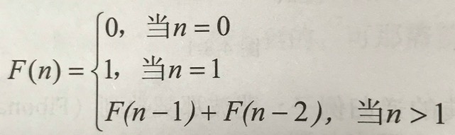

# data-structure-2
## 4 队列和栈  
栈和队列都是特殊的线性表，可以通过顺序存储结构和链式存储结构实现，只不过对插入和删除操作做了限制  
栈：后进先出，限定在表尾进行插入和删除操作    
[用python实现栈](py_stack.py)  
队列：先进先出，只能从队列一端插入数据，从队列另一端删除数据  
[用python实现队列](py_queue.py)  
### 4.1 栈  
#### 4.1.1 栈的定义  
限定仅在表尾进行插入和删除的操作  
栈顶(top)栈底(bottom)后进先出(LIFO结构)  
注意：这里的表尾是指栈顶top而不是栈底  
思考：最先进栈的元素是不是只能最后出栈？不一定  
栈的操作：  
插入（进栈、压、push）  
删除（出栈、弹、pop）  
#### 4.1.2 栈的顺序存储结构实现  
空栈的判定条件：top = -1 
满栈的判定条件：top = MAXSIZE-1  
进栈操作push的实现：插入元素e作为新的栈顶元素  
```
Status Push(SqStack *S, SElemType e)
{
  if(S->top == MAXSIZE-1)//栈满
    return ERROR;
  s->top++;//栈顶指针加一
  s->data[s->top]=e;//新加入元素e赋值给栈顶
  return OK;
}
```
出栈操作pop的实现：若栈不空，删除s的栈顶元素，用e返回值  
```
Status Pop(SqStack *S,SElemType e)
{
  if(S->top == -1)//栈空
    return ERROR;
  e = S->data[S->top];
  S->top--;
  return OK;
}
```
两栈共享空间：  
栈满条件(两个指针之间相差1)：top1+1=top2  
对于两栈共享空间的push和pop操作，需要有一个判断是栈1还是栈2的栈号参数stackNumber  
进栈push：  
```
Status Push(SqDoubleStack *S,SElemType e,int stackNumber)
{
  if(S->top+1==S->top2)
    return ERROR;
  if(int stackNumber==1)
    S->top1++;
    S->data[S->top1]=e;
  elif(stackNumber==2)
    S->top2--;
    S->data[S->top2]=e;
  return OK;
}
```
出栈pop：  
```
Status Pop(SqDoubleStack *S,SElemType e,int stackNumber)
{
  if(stackNumber==1)
  {
    if(S->top1 == -1)
      return ERROR;
    e=S->data[S->top1--];
  }  
  elif(stackNumber==2)
  {
    if(S->top2 == MAXSIZE)//如果栈空对于栈2来说是maxsize
      return ERROR;
    e=S->data[S->top2++];
  }
  return OK;
}
```
#### 4.1.3 栈的链式存储结构实现  
栈的链式存储结构简称“链栈”，如果栈的使用过程中元素变化不可预料最好用链栈，如果变化范围可控最好用顺序栈  
栈顶放在单链表的头部  
对于空栈，top=NULL  
链栈进栈操作：插入元素e为新的栈顶元素,e的新结点为p  
```
Status Push(LinkStack *S,SElemType e)
{
  LinkStackPtr p = (LinkStackPtr)malloc(sizeof(StackNode)):
  p->data=e;
  p->next=S->top;
  S->top=p;
  S->count++;
  return OK;
}
```
链栈出栈操作：删除S的栈顶元素，用e返回  
```
Status Push(LinkStack *S,SElemType e)
{
  LinkStackPtr p = (LinkStackPtr)malloc(sizeof(StackNode)):
  e=S->top->data;
  p=S->top;
  S->top=S->top->next;
  free(p);
  S->count--;
  return OK;
}
```
##### 4.1.4 栈的应用  
1.迭代与递归  
递归函数：一个直接或间接调用自己的函数  
递归函数必须要有终止条件，否则会陷入无穷循环中，消耗内存  
迭代使用的是循环结构，递归使用的是选择结构  
分别用迭代和递归的方法实现打印前40位斐波那契数列：  
斐波那契数列：前面相邻两项之和构成了下一项  
  
```
//迭代
int main()
{
int i;
int a[40];
a[0]=0;
a[1]=1;
printf("%d\n",a[0]);
printf("%d\n",a[1]);
for(i=2;i<40;i++)
  {
    a[i]=a[i-1]+a[i-2];
    printf("%d\n",a[i];
  }
return 0;
}
```
```
//递归
int Fbi(int i)
{
  if(i<2)
    return i==0?0:1;
  return Fbi(i-1)+Fbi(i-2);
}
int main()
{
  int i;
  for(i=0;i<40;i++)
    {
      printf("%d\n",Fbi[i];
    }
  return 0;
}

```
2.四则运算表达式求值  
需要掌握：  
将中缀表达式转换成后缀表达式  
将后缀表达式进行运算得出结果  
具体分析见大话数据结构104-110  
### 4.2 队列  
#### 4.2.1 队列定义  
队尾进，队头出的线性表  
先进先出（FIFO）  
#### 4.2.2 循环队列  
循环队列：头尾相接的顺序存储结构，解决“假溢出”  
引入两个指针，front指针指向队头元素，rear指向队尾元素  
判断队空的条件：front=rear  
判断队满条件：(rear+1)%QueuesSize=front  
通用的计算队列长度的公式：(rear-front+QueuesSize)%QueuesSize  
  
循环队列初始化  
```
Status InitQueue(SqQueue *Q)
{
Q->front=0;
Q->rear=0;
return OK;
}
```
  
求循环队列长度  
```
Status InitQueue(SqQueue Q)
{
  return (Q.rear-Q.front+MAXSIZE)%MAXSIZE;
}
```
  
循环队列的入队列操作  
```
Status EnQueue(SqQueue *Q,QElemType e)
{
  if((Q->rear+1)%MAXSIZE == Q->front)  //队列满
    return ERROR;
  Q->data[Q->rear] = e;
  Q->rear = (Q->rear+1)%MAXSIZE;  //rear指针向后移一位置，若到最后则转到数组头部 
  return OK;
}
```
  
循环队列的出队列操作  
```
Status EnQueue(SqQueue *Q,QElemType e)
{
  if(Q->rear == Q->front)  //队空
    return ERROR;
  e = Q->data[Q->front];
  Q->front = (Q->front+1)%MAXSIZE;  //front指针向后移一位置，若到最后则转到数组头部 
  return OK;
}
```
#### 4.2.3 队列的链式存储结构  
简称链队列  
front指向头结点，rear指向最后一个结点（队尾）  
注意：队头是在头结点后面，也就是front->next,删除元素就是从头结点之后的队头开始删除  
空队列时，rear和front都指向头结点  
在队列Q的队尾插入元素e：  
```
s->data = e;
s->next = NULL;
Q->rear->next = s;
Q->rear = s
```
删除队列Q的队头，用e返回其值：  
```
//设置指针p，用来存放要删除的
p = Q->front->next;
e = p->data;
Q->frint->next = p->next;
free(p);
```
